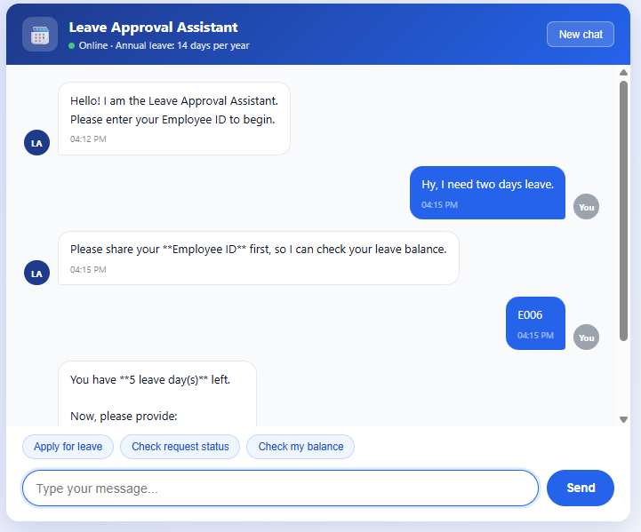

# Leave Approval Agent

An AI assistant that handles employee leave requests through a simple chat. The employee talks to the agent, it checks their leave balance, saves the request, and emails the manager with **Approve** and **Reject** buttons. The AI never approves leave itself. The final decision always stays with the manager.

**Live demo:** [https://leave-approval-agent-fcyi.onrender.com](https://leave-approval-agent-fcyi.onrender.com)

*(Hosted on Render's free tier, so the first load can take up to a minute while the server wakes up.)*



## Why I built this

In most small teams, leave requests move through chats and emails. Someone has to check the balance, remember the policy, and chase the manager for a reply. I wanted to see how much of that routine work an AI agent could handle while a human still makes the final call.

## What it does

- Chat-based leave requests: the agent asks for the employee ID, dates, and reason, one step at a time
- Checks the employee ID and leave balance before anything is saved
- Calculates the number of days in code instead of trusting the AI's arithmetic
- Rejects invalid dates, end dates before start dates, and dates in the past
- Saves the request as *Pending* in the database
- Keeps leave balances correct automatically with a database trigger, so the app code never has to adjust them by hand
- Emails the manager a clean message with one-click Approve and Reject buttons
- Lets the employee ask for the status of an existing request at any time
- Only talks about leave: anything off-topic gets a polite redirect
- Remembers the conversation, so employees don't have to repeat themselves

## Safety by design

- **Human in the loop.** The agent can create and track requests, but only the manager can approve or reject them.
- **Signed approval links.** Each Approve/Reject link carries an HMAC-SHA256 token built from the request ID, the action, and a secret key. Without the secret, nobody can fake or change a link.
- **One decision per request.** Once a request is approved or rejected, the same link can't change it again.
- **Code validates, not the AI.** Dates and day counts are checked in Python, because language models can make mistakes with dates and arithmetic.
- **Safe email content.** Employee-entered text is HTML-escaped before it goes into the manager's email.
- **Errors don't crash the chat.** Database and email failures return a clear message, and details go to the server logs.

## Tech stack

| Area | Tools |
|------|-------|
| Backend | Python, FastAPI, Uvicorn |
| AI agent | LangChain, LangGraph (ReAct agent with memory) |
| Language model | Mistral AI (`open-mistral-nemo`) |
| Database | Supabase (PostgreSQL) |
| Email | Resend API via HTTPX |
| Frontend | HTML (`templates/index.html`) |
| Hosting | Render |

## How it works

1. The employee opens the web page and starts chatting with the agent.
2. The agent asks for the employee ID and checks it against the database.
3. It asks for the start date, end date, and reason.
4. It checks that the employee has enough leave days left.
5. It saves the request as *Pending*. A database trigger in Supabase takes the days off the employee's balance automatically.
6. It emails the manager with signed Approve and Reject buttons.
7. The manager clicks Approve or Reject. The app checks the signed token and updates the request status in Supabase. A decision can only be made once. If the request is rejected, the database trigger gives the days back to the employee's balance. The employee can ask the agent for the result at any time.

### The agent's tools

| Tool | What it does |
|------|--------------|
| `check_leave_balance` | Confirms the employee exists and checks the balance |
| `create_leave_request` | Validates dates and saves a Pending request |
| `notify_manager` | Sends the approval email to the manager |
| `check_request_status` | Returns Pending, Approved, or Rejected |
| `get_employee_details` | Returns the employee's own details |

## Project structure

```
Leave-Approval-Agent/
├── main.py             # FastAPI app, chat route, and approve/reject route
├── leave_agent.py      # Agent, tools, prompt, and approval tokens
├── templates/
│   └── index.html      # Chat interface
├── schema.sql          # Balance trigger (run after creating the tables)
├── requirements.txt    # Python dependencies
├── screenshot.png      # App screenshot
└── README.md
```

## Getting started

**1. Clone the repository**

```bash
git clone https://github.com/Zubairbutt01/Leave-Approval-Agent.git
cd Leave-Approval-Agent
```

**2. Create a virtual environment and install dependencies**

```bash
python -m venv .venv

# Windows
.venv\Scripts\activate
# macOS / Linux
source .venv/bin/activate

pip install -r requirements.txt
```

**3. Set up the database**

Create a free project on [Supabase](https://supabase.com). A new project is empty, so first create these two tables:

- `employees`: employee_id, first_name, last_name, email, department_id, annual_leave_balance
- `leave_requests`: request_id, employee_id, start_date, end_date, total_days, reason, status (default `Pending`)

Then open the SQL editor and run [schema.sql](schema.sql) to add the leave balance trigger. Finally, add at least one employee row (for example ID `E001` with a balance of 14) so you can test the app.

**4. Add environment variables**

Create a `.env` file in the project root:

```
SUPABASE_URL=your_supabase_project_url
SUPABASE_KEY=your_supabase_key
MISTRAL_API_KEY=your_mistral_api_key
RESEND_API_KEY=your_resend_api_key
GMAIL_ADDRESS=manager_email_address
APPROVAL_SECRET=a_long_random_secret_string
BASE_URL=http://127.0.0.1:8000
```

- `GMAIL_ADDRESS` is the address that receives the approval emails.
- `APPROVAL_SECRET` signs the Approve/Reject links. Use a long random string.
- `BASE_URL` is the public address of the app. On Render, set it to your Render URL so the email links work.

**5. Run the app**

```bash
uvicorn main:app --reload
```

Open `http://127.0.0.1:8000` in your browser.

## Deployment

The app runs on Render:

- **Build command:** `pip install -r requirements.txt`
- **Start command:** `uvicorn main:app --host 0.0.0.0 --port $PORT`
- Add all the environment variables above in the Render dashboard.

## Known limitations

- Leave policy is fixed at 14 days per year for everyone.
- There is a single manager who receives every request.
- Resend's free test sender can only deliver to the email address on the Resend account. A verified domain is needed to email other people.
- The chat memory is stored in server memory, so it resets when the server restarts.

## What I learned

- Building a tool-using agent with LangGraph
- Writing a system prompt that keeps an AI on topic and following a strict workflow
- Why important checks belong in code and not in the model
- Securing links with HMAC signatures
- Letting a database trigger keep data consistent
- Deploying a FastAPI app with a managed database

## Future improvements

- Login and roles for employees, managers, and HR
- Different leave types (sick, casual, unpaid)
- Multiple managers and departments
- Team leave calendar
- Slack or WhatsApp notifications
- A complete one-click `schema.sql` that also creates the tables
- Automated tests

## Author

**Zubair Butt**

GitHub: [@Zubairbutt01](https://github.com/Zubairbutt01)

Project repo: [Leave-Approval-Agent](https://github.com/Zubairbutt01/Leave-Approval-Agent)
